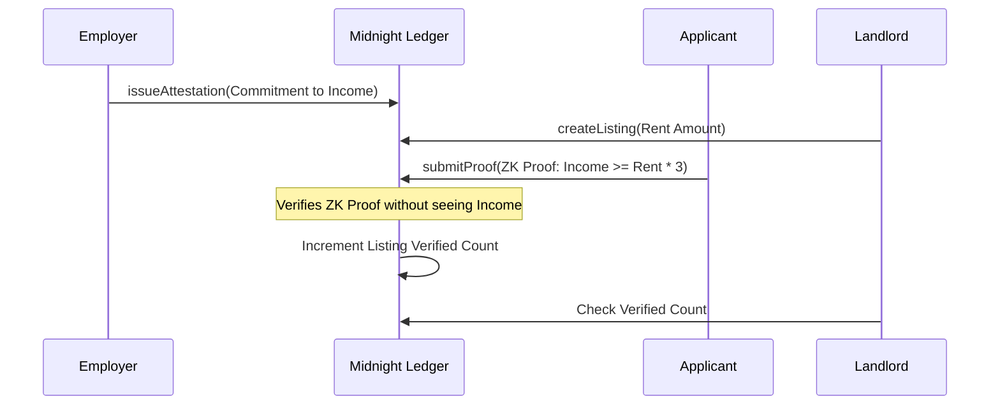

# Threshold


> Prove your income clears the bar. Not what it is.

## Social Media

- **X Profile:** [@Thresholdvk](https://x.com/Thresholdvk)
- **Launch Tweet:** [Read the announcement](https://x.com/Thresholdvk/status/2103977073698275560)

## Live Demo

- **Live DApp:** [https://threshold-nu-one.vercel.app/](https://threshold-nu-one.vercel.app/)
- **Demo Video:** [Watch on Google Drive](https://drive.google.com/file/d/1eZxJIZxfm-Ye7sFtpJYymsGvMIj8E5cD/view?usp=sharing)

## Preprod Contract Details

| Network | Address | Explorer Link |
|---------|---------|---------------|
| Preprod | `c6b3da083a22731a1053fcded5cc81227e283758b95b955c57bcd89804625496` | [View on Midnight Explorer](https://preprod.midnightexplorer.com/contracts/0xc6b3da083a22731a1053fcded5cc81227e283758b95b955c57bcd89804625496) |


**Submitted Proof Transaction:** [View on 1AM Explorer](https://explorer.1am.xyz/tx/7589c71e78ac66bebb8f81bcf8c155613b58aebb57c65636972621f789e8d9b9?network=preprod)


## Project Description

Threshold is a confidential income-verification protocol built on Midnight.
Renters today prove they can afford an apartment by handing landlords pay
stubs and bank statements — far more sensitive financial data than a
simple "income ≥ 3× rent" check actually requires. That over-disclosure
sits in tenant-screening databases as a standing breach risk, while
document-based verification is increasingly unreliable: AI-generated fake
pay stubs increased 500% between April and December 2025, and 93% of
property managers reported applicants submitting fabricated income
documents in the past year.

Threshold replaces the document with a cryptographic attestation. A
registered payroll provider or employer seals a commitment to an
applicant's real income. The applicant later proves — via a Compact
circuit — that this attested income clears a specific listing's
affordability bar, without ever revealing the figure, their employer, or
their transaction history.

## Project Vision

Built for renters who don't want their full financial history sitting in
a screening database, and landlords who can no longer trust a PDF. Our vision is to eliminate the need for sharing raw financial documents in standard consumer background checks, establishing a zero-knowledge standard where users only prove the boolean conditions required for a service, dramatically reducing identity theft and document fraud.

## Key Features

- **Zero-Knowledge Income Verification:** Prove your income meets a landlord's requirement without revealing the actual number.
- **Cryptographic Attestations:** Employers issue unforgeable commitments on-chain, eliminating the risk of fake pay stubs.
- **Listing-Specific Nullifiers:** Prevent applicants from re-submitting proofs for the same listing, ensuring accurate verified counts.
- **Fully On-Chain State:** No centralized databases holding sensitive applicant data.
- **Local ZK Circuit Execution:** The applicant's exact income and identity remain as private witnesses on their local device, never broadcasted to the network.

## App Screenshots

**1. Clean and responsive UI**


**2. Employer generates attestation keys & salts**


**3. ZK Proof generation & submission**


**4. Comprehensive test coverage for all ZK circuits**


## Architecture Diagrams



## Privacy Model

- **What is PUBLIC (on-chain, anyone can see):**
  - The registry of trusted issuer IDs (accredited payroll providers).
  - Each listing's rent amount and landlord ID (already public on any
    listing site).
  - Each attestation's commitment hash and which issuer created it.
  - A one-time nullifier per submitted proof, and a listing's running
    verified-applicant count.
- **What is PRIVATE (private witness, never on-chain):**
  - The applicant's real income.
  - The salt binding an attestation to one applicant.
- **What the user PROVES without revealing:**
  - That an attestation genuinely came from a trusted issuer, for this
    applicant, for a specific income (`submitProof` recomputes the
    issuer's commitment and checks it matches) — without revealing the
    income.
  - That the attested income meets a listing's affordability threshold
    (`income >= rent * multiplier`) — without revealing the exact figure.
  - That the applicant has not already claimed eligibility for this
    listing, via a listing-scoped nullifier.

## Tech Stack

- **Contract:** Compact (Midnight smart contract language)
- **Frontend:** React 18, TypeScript, Vite, Tailwind CSS
- **Wallet:** Lace (Midnight wallet connector), with a local demo-ledger
  fallback so the UI is fully explorable without a wallet installed
- **Testing:** Vitest — unit tests mirroring the circuits' issuer-trust,
  commitment, threshold, and nullifier logic
- **CI/CD:** GitHub Actions (lint, typecheck, test, build, best-effort
  Compact compile)

## Prerequisites

- [Lace wallet](https://www.lace.io/) browser extension, set to Preprod
- Node.js v22+
- Docker (required by the Midnight Compact toolchain for local proving)
- The [Compact compiler](https://docs.midnight.network) (`compactc` /
  `compact compile`) installed locally to compile `contracts/threshold.compact`

## Setup & Run Locally

```bash
# 1. Clone the repo
git clone https://github.com/anumehta70/threshold.git
cd threshold

# 2. Install frontend dependencies
npm install

# 3. (Optional) point the app at a deployed contract — otherwise it runs
#    in a local demo-ledger mode that mirrors the circuits exactly
cp .env.example .env
# edit .env and set VITE_CONTRACT_ADDRESS after you deploy (see below)

# 4. Compile the contract (requires the Compact toolchain + Docker)
compact compile contracts/threshold.compact managed/

# 5. Run the frontend
npm run dev
```

### Deploy to Preprod

```bash
# From the project root, after compiling:
compact deploy contracts/threshold.compact \
  --network preprod \
  --wallet <your-lace-wallet-address>
```

Paste the resulting contract address into the **Contract Address** table
above and into `.env` as `VITE_CONTRACT_ADDRESS`.

## Run Tests

```bash
npm test
```

15 tests cover: the issuer-trust check enforced by `issueAttestation`, the
commitment-recomputation, threshold, and replay-protection rules enforced
by `submitProof`, and the hashing helpers used to build commitments and
nullifiers — mirroring the circuit logic in `contracts/threshold.compact`
exactly.

## CI/CD

Every push to `main` and every pull request runs, via
[`.github/workflows/ci.yml`](.github/workflows/ci.yml):

1. `npm ci`
2. `npm run lint`
3. `npm run typecheck`
4. `npm test`
5. `npm run build`
6. A best-effort Compact compile step (runs when `compactc` is available)

## User Onboarding Detail

To use Threshold, users need:
1. The Lace Wallet extension installed and set to the Midnight Preprod network.
2. Testnet tDUST tokens (available from the faucet) to pay for transaction fees.
3. Users acting as applicants receive a secure "Attestation ID" and "Salt" out-of-band from their employer, which they enter into the dApp to compute their local zero-knowledge proof.

See [`docs/USAGE.md`](docs/USAGE.md) for a full step-by-step walkthrough: registering an
issuer, sealing an attestation, publishing a listing, proving eligibility,
and reading the public ledger.


## Future Scope

- **Multiple Attestation Providers:** Allowing multiple employers or payroll systems to attest to different income streams, which can be aggregated within the ZK circuit.
- **Dynamic Threshold Adjustments:** Enabling landlords to adjust multiplier requirements dynamically without re-deploying listings.
- **Integration with Identity Protocols:** Linking attestations to decentralized identity (DID) credentials to prove both "who I am" and "what I earn" in a single zero-knowledge transaction.
